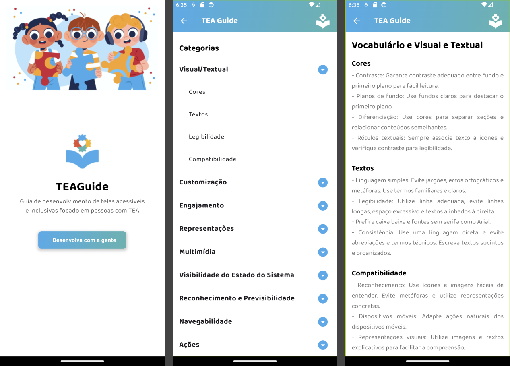

# TEAGuide


## Descrição

O TEAGuide é uma ferramenta guia projetada para ajudar desenvolvedores a criar telas acessíveis para pessoas com Transtorno do Espectro Autista (TEA), ajudando-as a navegar e interagir com informações de maneira mais fácil e eficiente. O app oferece uma interface amigável e recursos visuais para tornar a experiência mais inclusiva e acessível.

## Funcionalidades

- **Navegação Intuitiva**: Interface amigável com uma barra de navegação consistente em todas as telas.
- **Conteúdo Visual**: Itens apresentados com imagens e descrições detalhadas para melhor compreensão.
- **Texto Claro e Simples**: Descrições e informações escritas de forma clara e direta, evitando jargões e termos técnicos.
- **Gradiente de Cores**: Uso de cores contrastantes para melhorar a legibilidade e a diferenciação entre seções.
- **Compatibilidade**: Adaptado para dispositivos móveis com representações visuais e ícones intuitivos.

## Tutorial de Instalação

Para instalar e executar o TEAGuide localmente, siga os passos abaixo:

### Pré-requisitos

- **Flutter**: Certifique-se de ter o Flutter instalado em seu sistema. Para instalar, siga as instruções na [documentação oficial do Flutter](https://flutter.dev/docs/get-started/install).

### Passos para Instalação

1. **Clone o Repositório**

   ```bash
   git clone https://github.com/milenaduarteicev/TEAguide.git
   ```

2. **Navegue para o Diretório do Projeto**

   ```bash
   cd teaguide
   ```

3. **Instale as Dependências**

   ```bash
   flutter pub get
   ```

4. **Execute o App**

   ```bash
   flutter run
   ```

## Imagens

### Telas do App




## GIF


# Autores

- [Milena Duarte](https://github.com/milenaduarteicev)
- [Max Santos]()
- [Herminio Granja]()
- [Marcos Vinnícius Carvalho]()
- [Guilherme Vinicius Costa]()
- [Luiz Antonio Miranda]()

